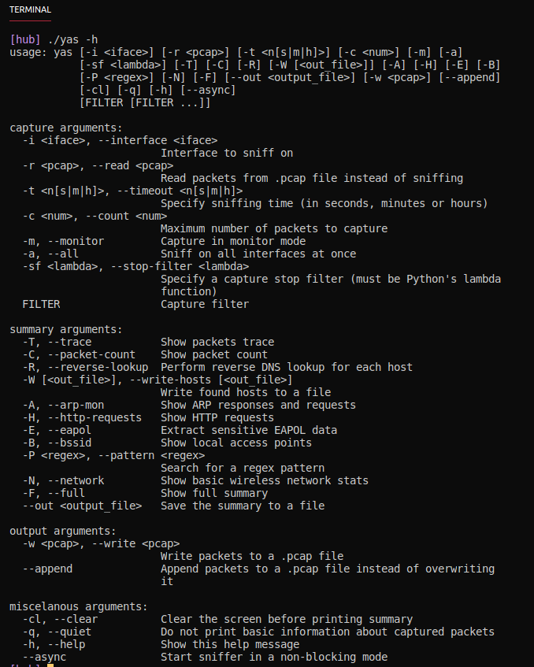

# YAS     

YAS (Yet Another Sniffer) is a Scapy-based network analyzer. It bundles some useful functionalities into a single tool, making it easy to extract different information about network traffic.

## Features
- Read from and write to .pcap files
- Monitor ARP requests/responses
- Sniff on multiple interfaces
- Extract EAPOL data
- Save detected hosts to a file
- Perform reverse DNS lookup
- Show local access points
- Show packet trace and detailed packets count
- Highlight local Gateway and Domain Controller
- Search for regular expressions
- Monitor HTTP requests
- Sniff in asynchronous mode

## Examples of use
Read packets from a .pcap file; show information about Access Points:

`./yas.py -r file.pcap -B`

Show ARP traffic and reverse DNS lookup; sniff on all interfaces and write capture to .pcap: 

`./yas.py -a -A -R`-w file.pcap

Run sniffer for 10 minutes on selected interface, and write IP addresses of found hosts to a file:

`./yas -t 10m -W hosts_file -i wlan0`

## Help menu

## License
This software is under [MIT License](https://en.wikipedia.org/wiki/MIT_License)